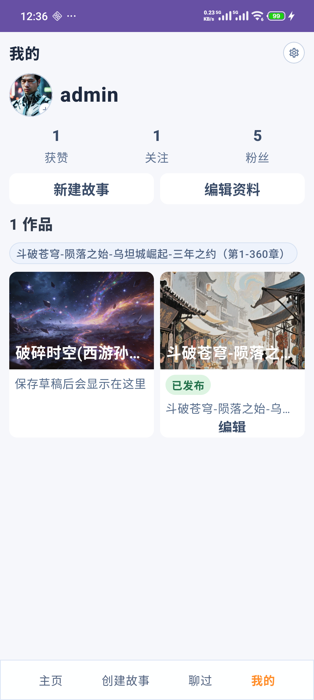
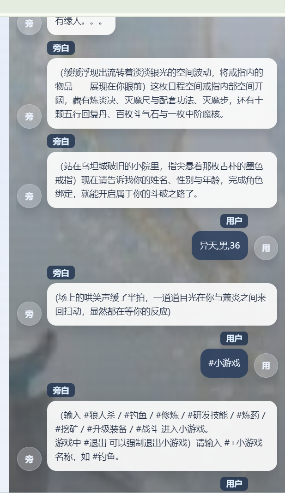

<p>
  <a href="https://github.com/HBAI-Ltd/Toonflow-app">
    
  </a>
  &nbsp;|&nbsp;
  <a href="https://gitee.com/HBAI-Ltd/Toonflow-app">
    
  </a>
</p>

<p align="center">
  <strong>中文</strong> | 
  <a href="./docs/README.en.md">English</a>
</p>

<div align="center">


# Toonflow
[README.o1.md](README.Toonflow.md)

Toonflow 是"Toonflow Game" 的前身，在当前项目更多是残留功能而不是主要功能。
  <p align="center">
    <b>
      AI短剧工厂
      <br />
      动动手指，小说秒变剧集！
      <br />
      AI剧本 × AI影像 × 极速生成 🔥
      <br />
       ai故事游戏 🔥🔥🔥
    </b>
  </p>
  <p align="center">
    <a href="https://github.com/HBAI-Ltd/Toonflow-app/stargazers">
      
    </a>
    <a href="https://www.gnu.org/licenses/agpl-3.0" target="_blank">
      
    </a>
    <a href="https://github.com/HBAI-Ltd/Toonflow-app/releases">
      
    </a>
  </p>
  
  > 🚀 **一站式短剧工程**：从文本到角色，从分镜到视频，0门槛全流程AI化，创作效率提升10倍+！
  
</div>

# "Toonflow Game"
"Toonflow Game" 在Toonflow基础上进行的二度开发
 🚀 **多角色沉浸感ai故事游戏**: 体验沉浸式ai故事游戏，感受角色互动的魅力！

## github url
https://github.com/topics/toonflow-game
https://github.com/viaco2ove/Toonflow-game.git
~~https://github.com/viaco2ove/Toonflow-game-vedio-web.git~~
https://github.com/viaco2ove/Toonflow-game-web.git
~~https://github.com/viaco2ove/Toonflow-game-android.git~~
https://github.com/viaco2ove/Toonflow-game-android-h5.git

---
# 🌟 主要功能
多角色 ai 游戏


## 特殊功能
- 在输入框输入“#小游戏” 可以进行查看钓鱼等小游戏的玩法。


- 在输入框输入“@记忆管理 xxx” 可以要求ai 变更人物参数
如：@记忆管理 睡觉恢复，可以恢复hp mp

- 战斗属性
### 血量和蓝的恢复（hp 和mp）：" +
```
"用户住宿、睡觉和吃下恢复药物等可以恢复血量和蓝到充盈满血满蓝，" +
"要把用户参数进行修改到满血满蓝，hp 和 mp 必须直接输出数字，不能写“已恢复”“满了”“充盈”等中文状态\n" +
"### 满血：基础血量100 + 等级*10 + 特殊物品或者技能加成，如物品里的血量属性点(2)\n" +
"### 满蓝：基础蓝量100 + 等级*10 + 特殊物品或者技能加成，如物品里的蓝量属性点(2)\n" +
"### 攻击力：基础攻击力10 + 等级*10 + 特殊物品或者技能加成，如物品里的攻击点属性点(2)\n" +
"### 防御力：基础防御1 + 等级*10 + 特殊物品或者技能加成，如物品里的防御点属性点(2)\n"
```

- @记忆管理 下个章节
理论上可行
- @事件进度检测 下个事件
理论上可行

- @角色名 xxx
可以呼叫这个角色


# 🌟 主要功能(old)
[README.V1.md](README.V1.md)
---

## web日志
禁止使用 `console.log`
只能使用 WebDebugLogUtil.log

## 后端日志
禁止使用 `console.log`
只能使用 DebugLogUtil.log


## 本地模型安装
[本地头像分离模型安装.md](md/modeapi/image/%E6%9C%AC%E5%9C%B0%E5%A4%B4%E5%83%8F%E5%88%86%E7%A6%BB%E6%A8%A1%E5%9E%8B%E5%AE%89%E8%A3%85.md)

# 🚀 安装

## 前置条件
## nodejs 22
npm install -g n
n 22
## 本机安装
yarn install

## 运行
chcp 65001 >nul
yarn dev
or
yarn local

## 打包
yarn bulid


### 如何清理
rm -rf node_modules dist .cache &&

### 项目交互原则
不是面对记忆开发而是面对注意力开发。
我发现你把用户的注意力吸住比做让大模型记住超长上下文更有用。
你就不要让用户问角色：你一个月前做了啥。（也不是完全不检索而是让用户不会把注意力放在记忆上面）

实际上 Toonflow 的问题是故事前期token 消耗大， 速度也慢。  但是玩法更丰富。而且实际上所谓的失忆 多数情况并不是 忘了前面的东西，而是角色设定和世界设定的回归性，我们给ai 发送的都是动态修改的数据。 
这种真正的高频失忆 的情况根本不会发生。 
只有真正的低频但是 使用者以为高频甚至大多数开发者误以为的高频。
实际低频的一个月前的某个细节。


## Toonflow-game
[](https://github.com/viaco2ove/Toonflow-game)

作者：viaco2love

链接：https://blog.csdn.net/viaco2love/article/details/161095553?fromshare=blogdetail&sharetype=blogdetail&sharerId=161095553&sharerefer=PC&sharesource=viaco2love&sharefrom=from_link

来源：csdn


## Toonflow
[](https://github.com/HBAI-Ltd/Toonflow-app)

作者：HBAI-Ltd

链接：https://www.bilibili.com/video/BV1oXD7BqEqJ

来源：哔哩哔哩
