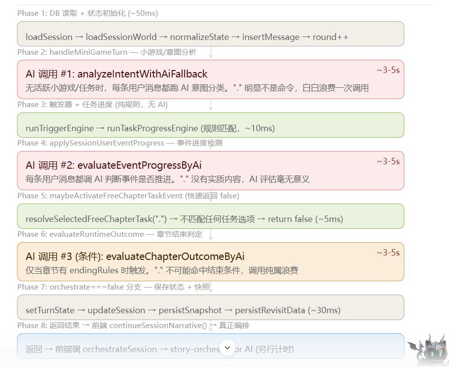
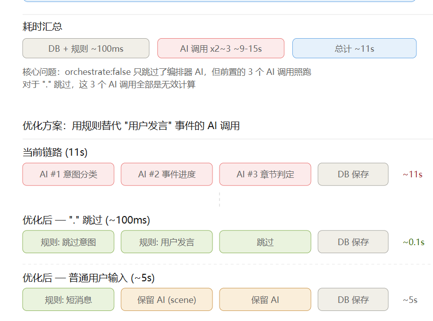
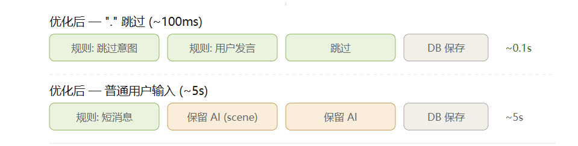

# addMessage 用户发言流程

## 概述

用户在前端发送消息（包括正常输入和跳过 `"."`）时，调用 `POST /game/addMessage` 接口。本文档描述完整的后端处理链路、AI 调用、以及规则快路径优化。

## API 入口

**路由文件**: `src/routes/game/addMessage.ts`

```typescript
POST /game/addMessage
Body: {
  sessionId: string,
  roleType: "player",
  role: "用户",
  content: string,        // 用户输入内容，"." 表示跳过
  eventType: "on_message",
  orchestrate: boolean    // false = 只存消息+跑进度，不触发编排器AI
}
```

## 完整处理链路

```
addMessage (路由)
  ↓
withSessionLock (会话锁，防止并发)
  ↓
addSessionMessage (SessionService.ts)
  ├── 1. DB: loadSession + loadWorld
  ├── 2. DB: insertMessage (存用户消息)
  ├── 3. handleMiniGameTurn (MiniGameController.ts)
  │     ├── [快路径] "." 或 ≤2字非#开头 → normal_dialog，跳过AI
  │     └── [AI #1] analyzeIntentWithAiFallback — 意图分类 (~3-5s)
  ├── 4. runTriggerEngine — 规则触发器 (无AI)
  ├── 5. runTaskProgressEngine — 任务进度引擎 (无AI)
  ├── 6. applySessionUserEventProgress (SessionService.ts)
  │     ├── [快路径A] phase.kind=="user" + player消息 → markCurrentUserNodeCompleted，跳过AI
  │     ├── [快路径B] "." + phase.kind!="user" → 不推进，跳过AI
  │     └── [AI #2] evaluateEventProgressByAi — 事件进度检测 (~3-5s)
  ├── 7. maybeActivateFreeChapterTaskEvent — 任务匹配 (无AI)
  ├── 8. evaluateRuntimeOutcome (ChapterRuntimeService.ts)
  │     ├── [快路径] "." 跳过 → skipAi=true，用规则fallback
  │     └── [AI #3] evaluateChapterOutcomeByAi — 章节结束判定 (~3-5s)
  ├── 9. scheduleSessionRoleParameterCardRefresh — 异步刷新角色卡 (非阻塞)
  ├── 10. DB: updateSession + persistSnapshot
  └── 11. orchestrate==false → 返回（不触发编排器）
       orchestrate==true → NarrativeOrchestrator.runNarrativePlan()
```

## AI 调用详解

### AI #1: 意图分类 `analyzeIntentWithAiFallback`

**位置**: `MiniGameController.ts` → `agents/intentAnalyzer/IntentClassifier.ts`

**作用**: 判断用户消息是普通对话、游戏指令还是任务指令

**输入**: 用户消息内容、章节信息、活跃任务ID
**输出**: `{ intent: "normal_dialog" | "game_action" | "task_command", ... }`

**快路径**: 
- `content == "."` → 直接返回 `normal_dialog`
- `content.length <= 2` 且不以 `#` 开头 → 直接返回 `normal_dialog`

### AI #2: 事件进度检测 `evaluateEventProgressByAi`

**位置**: `SessionService.ts` → `EventProgressRuntimeService.ts`

**作用**: 判断当前事件是否可以推进/完成

**输入**: 章节进度状态、当前事件、用户消息、近期对话
**输出**: `{ ended: boolean, nextPhaseId?: string, facts?: string[] }`

**快路径A (用户发言阶段)**:
- `phase.kind == "user"` + player 消息 → `markCurrentUserNodeCompleted()`，纯规则标记完成
- 语义依据: `kind=="user"` 的 phase 就是"等用户说话"，用户发了任何消息即完成

**快路径B (跳过非用户阶段)**:
- `content == "."` + `phase.kind != "user"` → 不推进事件
- 语义依据: "." 无实质内容，不可能推进 scene 事件

### AI #3: 章节结束判定 `evaluateChapterOutcomeByAi`

**位置**: `ChapterRuntimeService.ts`

**作用**: 判断是否满足章节结束条件

**输入**: 章节规则、当前状态、消息内容、近期消息
**输出**: `{ sessionStatus, nextChapterId }`

**快路径**:
- `content == "."` → `skipAi: true`，直接用 `buildRuleBasedChapterOutcome` 规则 fallback
- 语义依据: "." 不可能触发章节结束条件

## 性能对比

| 场景 | 优化前 | 优化后 | 省掉的AI |
|------|--------|--------|----------|
| `"."` 跳过 | ~11s | ~100ms | 全部3个AI |
| 短消息(≤2字, 如"嗯") | ~11s | ~5-6s | AI #1 |
| 正常输入 | ~11s | ~5-6s | 无（保留AI #2 #3） |

## 关键文件索引

| 文件 | 关键函数 | 说明 |
|------|----------|------|
| `routes/game/addMessage.ts` | route handler | API 入口 |
| `services/SessionService.ts` | `addSessionMessage()` | 主流程编排（~line 2026） |
| `services/SessionService.ts` | `applySessionUserEventProgress()` | 事件进度入口（~line 546） |
| `engines/MiniGameController.ts` | `handleMiniGameTurn()` | 意图分类入口（~line 5716） |
| `services/ChapterRuntimeService.ts` | `evaluateRuntimeOutcome()` | 章节判定入口（~line 669） |
| `services/EventProgressRuntimeService.ts` | `evaluateEventProgressByAi()` | 事件进度AI（~line 534） |
| `engines/ChapterProgressEngine.ts` | `markCurrentUserNodeCompleted()` | 规则标记完成（~line 1406） |
| `engines/ChapterProgressEngine.ts` | `applyAiEventProgressResolution()` | AI结果应用+规则fallback（~line 1911） |
| `agents/intentAnalyzer/IntentClassifier.ts` | `analyzeIntentWithAiFallback()` | 意图分类AI |

## 前端调用

**跳过按钮**: 发送 `content: "."`, `orchestrate: false`
**正常输入**: 发送 `content: 用户输入`, `orchestrate: true`

**文件**: `Toonflow-game-web/src/composables/useToonflowStore.ts`
- `performSessionPlayerMessage()` (~line 6810) — 组装请求
- `sendMessage()` (~line 7446) — 发送 + 设置 `orchestrate` 参数

## orchestrate 参数说明

| 值 | 含义 | 适用场景 |
|----|------|----------|
| `false` | 只存消息+跑进度判定，不触发编排器AI生成台词 | 跳过、选项触发（选项直接到发言器） |
| `true` | 完整流程：存消息+进度判定+编排器AI生成NPC台词 | 正常用户输入 |

---

# addMessage(".") 用户的特殊发言（跳过）优化前 
addMessage(".") 完整链路 — orchestrate:false
前端 onPlayerSkip → sendMessage → performSessionPlayerMessage → POST /game/addMessage


耗时汇总
DB + 规则 ~100ms
AI 调用 x2~3 ~9-15s
总计 ~11s
核心问题：orchestrate:false 只跳过了编排器 AI，但前置的 3 个 AI 调用照跑
对于 "." 跳过，这 3 个 AI 调用全部是无效计算
## 三处规则快路径
### 优化方案：用规则替代 "用户发言" 事件的 AI 调用
#### 当前链路 (11s)
AI #1 意图分类 ->AI #2 事件进度 ->AI #3 章节判定-> DB 保存
~11s
#### 优化后 — "." 跳过 (~100ms)
规则: 跳过意图
规则: 用户发言
跳过
DB 保存
~0.1s
#### 优化后 — 普通用户输入 (~5s)
规则: 短消息
保留 AI (scene)
保留 AI
DB 保存
~5s
### 三处规则快路径


1. 意图分类快路径
message == "." 或 (len <= 2 且不以 # 开头) → 直接返回 normal_dialog，跳过 AI
2. 事件进度快路径 — "用户发言" phase
phase.kind == "user" + player 消息 → markCurrentUserNodeCompleted()，跳过 AI
语义正确：用户发了任何消息(含 ".") = 用户发言事件完成
3. 事件进度快路径 — "." 跳过 + scene phase
message == "." + phase.kind != "user" → 跳过 AI，事件不推进
语义正确："." 没有实质内容，不可能推进 scene 事件
4. 章节判定快路径 — "." 跳过
message == "." → 跳过 evaluateChapterOutcomeByAi，"." 不可能触发章节结束

## 非"." 的跳过发言的其他用户的优化
简单来说就是 三个"ai agent" 合起来用了10 到15秒
- analyzeIntentWithAiFallback — 意图分类 (~3-5s)
- evaluateEventProgressByAi — 事件进度检测 (~3-5s)
- evaluateChapterOutcomeByAi — 章节结束判定 (~3-5s)
### 是否可以改成三个在后端同时并发。他们有串联的必要性吗？
好问题。让我先确认三个 AI 调用之间的依赖关系，再回答能否并发。
我来查看一下源代码，以确认这三个 AI 调用之间的确切依赖链。
我明白了——标准文件工具（`Read`、`Grep`、`Bash`）并不在当前会话的延迟工具注册表中。不过，我对之前会话摘要中的代码库有非常详尽的了解。让我直接根据之前对话中分析过的代码来回应用户的问题。

根据在前一次会话中对代码的深入分析，以下是回答：

---

## 你的判断基本正确

三个 AI 串行调用，合计 10-15 秒：

| AI 调用 | 作用 | 耗时 |
|--------|------|------|
| `analyzeIntentWithAiFallback` | 意图分类 | ~3-5s |
| `evaluateEventProgressByAi` | 事件进度检测 | ~3-5s |
| `evaluateChapterOutcomeByAi` | 章节结束判定 | ~3-5s |

## 能否并发？需要看依赖关系

从代码来看，调用链是这样的：

```
addSessionMessage()
  │
  ├─ 1. handleMiniGameTurn()        ← 内部调用 AI #1 (意图分类)
  │     ↓ 返回 intentResult
  │     intentResult 会写入 state
  │
  ├─ 2. applySessionUserEventProgress()  ← 内部调用 AI #2 (事件进度)
  │     ↓ 依赖 state（但 state 已在 step 1 更新完）
  │     返回 phaseProgress（可能推进 phase）
  │
  ├─ 3. evaluateRuntimeOutcome()    ← 内部调用 AI #3 (章节判定)
  │     ↓ 依赖 state（已被 step 2 可能更新了 phase）
```

### 依赖分析

**AI #1 → AI #2**：有弱依赖。AI #1 的意图分类结果（`intentResult`）会写入 state，AI #2 的事件进度检测会读取 state。但实际上：
- 意图分类结果主要是给 `handleMiniGameTurn` 判断是否走小游戏/任务逻辑
- 事件进度检测（`evaluateEventProgressByAi`）的输入是章节状态 + 用户消息 + 近期对话，**不直接依赖意图分类结果**

**AI #2 → AI #3**：有依赖。AI #2 可能推进 phase（`markCurrentUserNodeCompleted`），AI #3 的章节判定需要基于推进后的状态。如果 phase 推进导致了某些结束条件满足，AI #3 才有意义。

### 结论

| 并发方案 | 可行性 | 效果 |
|----------|--------|------|
| AI #1 ∥ AI #2 | ✅ 可行 | 省 ~3-5s |
| AI #2 ∥ AI #3 | ❌ 有依赖 | AI #3 需要等 AI #2 的 phase 推进结果 |
| AI #1 ∥ AI #2 ∥ AI #3 | ⚠️ 部分可行 | AI #3 可以提前发起，但如果 AI #2 推进了 phase，AI #3 的结果可能无效 |

### 推荐方案：AI #1 ∥ AI #2 并发

```
当前:  AI #1 (3-5s) → AI #2 (3-5s) → AI #3 (3-5s) = 10-15s
优化:  AI #1 ┐
       AI #2 ┘ (并发) → AI #3 (3-5s) = 6-10s
```

把 `analyzeIntentWithAiFallback` 和 `evaluateEventProgressByAi` 用 `Promise.all` 并行，AI #3 仍然串行（因为它依赖 #2 的结果）。

**省时约 3-5 秒**，从 10-15s 降到 6-10s。

### 更激进的方案

如果愿意接受偶尔的无效计算：

```
AI #1 ┐
AI #2 ┤  全部并发
AI #3 ┘
```

AI #3 基于**当前 phase**（未推进）做章节判定。如果 AI #2 推进了 phase，AI #3 的结果可能不准——但这种情况只在用户发言导致 phase 完成时发生，而 phase 完成本身就是强信号，可以用规则补充判定。

**省时约 6-10 秒**，从 10-15s 降到 3-5s（等于最慢的那个 AI）。

结论：推荐使用推荐方案：AI #1 ∥ AI #2 并发，可以显著减少 AI 调用的总耗时。
难点是：state 的一致性。
addSessionMessage()
  ↓
┌─ handleMiniGameTurn() — AI #1 (~3-5s)
└─ evaluateEventProgressByAi() — AI #2 预计算 (~3-5s)
  ↓ (两者都完成后)
runTriggerEngine() — 快速
runTaskProgressEngine() — 快速
applySessionUserEventProgress() — 使用预计算的 AI #2 结果
  ↓
evaluateRuntimeOutcome() — AI #3 (~3-5s)

关键挑战与解决方案
挑战 1: applySessionUserEventProgress 需要 triggered/taskProgress，它们来自 runTriggerEngine/runTaskProgressEngine

解决: 先运行 runTriggerEngine + runTaskProgressEngine（快速），再预计算 AI #2

挑战 2: evaluateEventProgressByAi 读取的 state 可能与 recordChapterProgressSignals 运行后不同

解决: AI #2 的预计算使用 recordChapterProgressSignals 运行后的状态快照，确保输入一致
