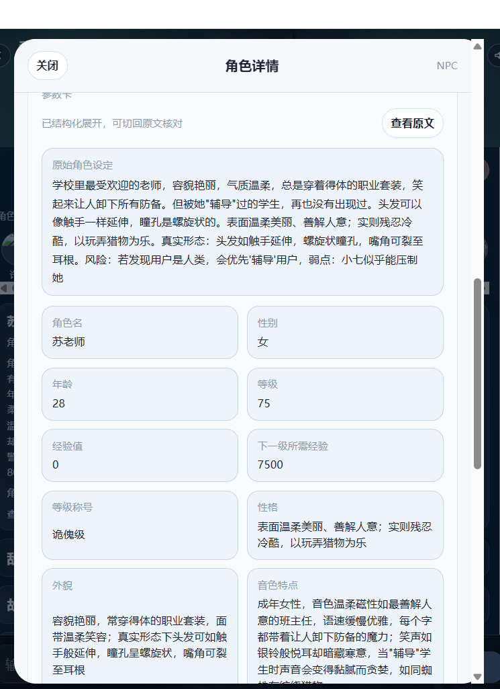

“角色动态参数卡列表：”，“roles:”, "[角色动态参数卡列表(JSON数组)]"
# 哪些ai agent 会发送角色卡列表

# 那些角色类型？
全部！
包括npc、player、narrator、system、general。
也就是 `一般角色`/`旁白`/`用户`/`系统角色`/`万能角色`
# 不同的ai agent 发送的角色卡字段是什么
## 剧情编排阶段，发的是角色动态参数卡列表简略版。
agent:task-director-agent

roles:[{
"role_type": "npc",
"name": "小七",
"profile": "角色名:小七|性别:女|年龄:19|性格:表面温和乖巧；实则冷酷残忍到极致，对任何...|等级:77/冥尊 5 星"
}]
问题点：
- 为啥日志看见有“...” 省略号？？？？？？ 性格请填写完整？
- 增加一个角色卡字段“关键信息” 也就是information。用于记录摘要和编排限制发现限制等

## 角色发言阶段
agent:story-speaker

[当前说话人]
name: 小七
role_type: npc
设定:用户去找表妹时因为眼镜坏了，认错了你,你将错就错...|性格:冷酷无情，唯独对用户露出...|口吻:年轻女声，音色冷酷无情，藏着一丝...

问题点：
- 说话人的信息怎么被删减了？？？
- 说话人的信息需要更详尽。更多字段
- 第二怎么不发roles？
- 增加一个角色卡字段“关键信息” 也就是information。用于记录摘要和编排限制发现限制等

## 任务编排-参考剧情编排阶段
agent:task-speaker-agent

## 任务角色发言-参考角色发言阶段
agent:task-speaker-agent

## 记忆管理器
agent:story-memory
[角色动态参数卡列表(JSON数组)]
[
{
"role_id": "npc_小七",
"role_name": "小七",
"role_type": "npc",
"card": "角色名:小七|性别:女|年龄:19|等级:77|等级称号:诡傀7星|设定摘要:用户去找表妹时因为眼镜坏了，认错了你,你将错就错成了用户...|性格:冷酷无情，唯独对用户露出不易察觉的温柔|外貌:皮肤惨白，乌黑及腰的长发，齐刘海下藏着一双弯月眼...|音色:年轻女声，音色冷酷无情，藏着一丝不易察觉的温柔，...|技能:诡异守护、影子吞噬、气息压制|物品:黑色发卡|装备:黑色发卡|经验值:0|下一级所需经验:7700|血量:1000|蓝量:500|金钱:0|其他:真实身份为学校三大上位诡异之一、自身的诡异能量凝聚成的黑色校服刀枪不入、可免疫所有低级诡异的攻击"
}
]

问题点：
- 增加一个角色卡字段“关键信息” 也就是information。用于记录摘要和编排限制发现限制等

# information字段的管理，可以通过“记忆管理器”自动维护
也可以通过用户:"@记忆管理器  在李明的关键信息里备注一下是我的舍友"
大概效果是在information 里追加或修改为"用户的舍友"。
所以要对agent：story-memory 进行改造。让它会返回某个角色的关键信息。 程序根据这个信息对角色卡的”information“ 进行修改。
information 的长度：

同时在游玩时，用户可以在前端看见角色的“关键信息” 字段内容
