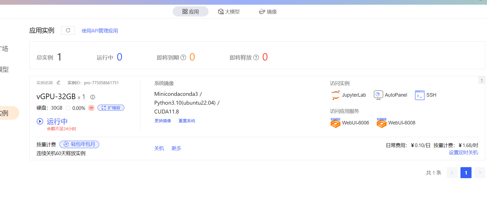
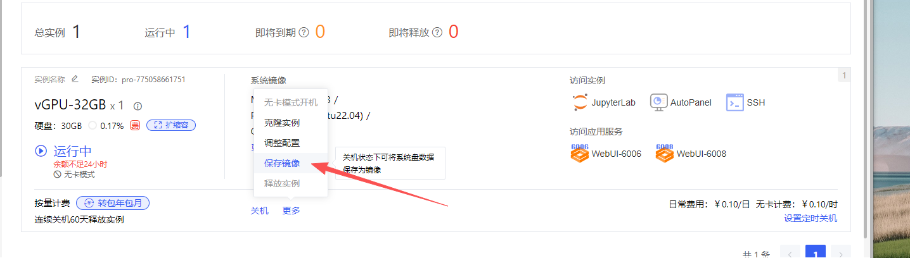

# AutoDL 镜像部署

## 目的

这套部署用于在 AutoDL 或其他 Linux 容器环境中运行 Toonflow 的：

- Node/Express 后端
- nginx 托管的前端静态页
- 单端口对外访问
- 持久化数据库、上传资源和本地工具目录

不包含 Electron GUI。

## 文件

- `docker/Dockerfile.autodl`
- `docker/docker-compose.autodl.yml`
- `docker/nginx.autodl.conf`
- `docker/supervisord.autodl.conf`
- `docker/autodl.env.example`

## 启动前

至少确认以下环境变量：

```env
AUTODL_HTTP_PORT=6006
AUTODL_PUBLIC_URL=http://127.0.0.1:6006/
TEMP_OSS=
```

说明：

- `AUTODL_HTTP_PORT` 建议用 AutoDL 支持的 `6006` 或 `6008`，默认用 `6006`
- `AUTODL_PUBLIC_URL` 会写入后端 `OSSURL`
- 上传图片、语音预览、章节背景、角色头像等资源链接都依赖这个地址
- 如果这里仍是 `127.0.0.1`，外部访问图片和音频会失败
- 但如果你走的是 SSH 隧道，本机浏览器访问的就是 `http://127.0.0.1:6006/`，这里保持默认即可

## 启动

```bash
cp docker.md/autodl.env.example docker.md/.env.autodl
docker.md compose --env-file docker.md/.env.autodl -f docker.md/docker.md-compose.autodl.yml up -d --build
```

## 两种访问方式

### 1. SSH 隧道

适合个人用户，或还没有 AutoDL 自定义服务公网入口时。

保持 `docker/.env.autodl` 默认值：

```env
AUTODL_HTTP_PORT=6006
AUTODL_PUBLIC_URL=http://127.0.0.1:6006/
```

容器启动后，在你本地电脑执行 AutoDL 官方 SSH 隧道命令，把实例内 `6006` 代理到本地 `6006`。

官方文档：
- <https://www.autodl.com/docs/ssh_proxy/>

这样本地浏览器访问：

```text
http://127.0.0.1:6006/
```

这时图片、音频等资源地址也会正常，因为后端生成的 `OSSURL` 与你浏览器看到的地址一致。

### 2. AutoDL 自定义服务

适合已经开通自定义服务能力的实例。

步骤：

1. 先保持 `AUTODL_HTTP_PORT=6006` 启动容器。
2. 到 AutoDL 控制台查看该实例的“自定义服务”分配地址。
3. 把 `docker/.env.autodl` 里的 `AUTODL_PUBLIC_URL` 改成这个公网地址。
4. 重新启动容器。

示例：

```env
AUTODL_HTTP_PORT=6006
AUTODL_PUBLIC_URL=https://你的-autodl-公网地址/
```

说明：

- AutoDL 的公网访问地址通常是在实例启动、服务暴露之后，去控制台查看“自定义服务”时拿到
- 不是部署前就固定写死的
- 如果你还没拿到这个地址，就先用 SSH 隧道方案

官方文档：
- <https://www.autodl.com/docs/port/>
- <https://www.autodl.com/docs/service_agreement/>

## 数据目录

compose 默认把数据挂到：

```text
../data/autodl -> /data/toonflow
```

其中包括：

- `db.sqlite`
- `uploads/`
- `tools/`
- `logs/`

## 说明

- 这套镜像默认启用 `PREFER_PROCESS_ENV=1`，优先使用容器注入环境变量，而不是仓库里的 `env/.env.local`
- 镜像会复制 `res/voice-presets`，保证内置语音种子在容器里可用
- 镜像安装了 `python3/python3-venv/python3-pip/ffmpeg`，便于运行本地 BiRefNet 和 GIF 转换链路
- 当前本地 BiRefNet 仍是 CPU 版 `onnxruntime`，不会自动使用 AutoDL GPU


## 部署流程（当前项目）
### 1. 创建基础实例

先创建一个 Linux 基础实例即可，建议：

- 系统镜像：`Miniconda / Python3.10 / ubuntu22.04 / CUDA11.8` 或同类 Ubuntu 镜像
- 磁盘：至少 `30GB`
- 对外端口：后续使用 `6006` 或 `6008`

示例：



### 2. 通过 SSH 进入实例

推荐直接用 AutoDL 提供的 SSH 连接方式进入实例。

进入后建议先准备基础工具：

```bash
apt-get update
apt-get install -y git rsync
apt-get install -y curl ca-certificates
curl -fsSL https://deb.nodesource.com/setup_20.x | bash -
apt-get install -y nodejs
npm install -g yarn@1.22.22
```

### 3. 拉取当前项目仓库

当前项目实际包含两部分：

- 后端与 Docker 部署仓库：`toonflow-game-app`
- 前端源码仓库：`Toonflow-game-web`

因为 AutoDL 镜像最终复制的是本仓库的 `scripts/web`，所以如果你要部署“当前最新项目”，需要先在前端仓库构建，再把产物同步到本仓库。

```bash
cd /root
git clone <你的 toonflow-game-app 仓库地址>
git clone <你的 Toonflow-game-web 仓库地址>
```

如果仓库已经在实例里，直接 `git pull` 即可。

### 4. 构建前端并同步到当前项目

先构建前端：

```bash
cd /root/Toonflow-game-web
yarn
yarn build
```

然后把前端产物同步到当前项目的 `scripts/web`：

```bash
mkdir -p /root/toonflow-game-app/scripts/web
rsync -a --delete /root/Toonflow-game-web/dist/ /root/toonflow-game-app/scripts/web/
```

说明：

- `scripts/web/index.html` 是部署镜像真正使用的静态前端入口
- 不先同步 `dist`，容器里跑的就不是当前前端代码

### 5. 
[run.md](run/run.md)

### 6.nginx
[run.nginx.md](run/run.nginx.md)

### 8. 访问项目

#### 方式一：SSH 隧道

在本地建立到实例 `6006` 的隧道后，浏览器打开：

```text
http://127.0.0.1:6006/
```

#### 方式二：AutoDL 自定义服务

如果实例已经暴露了 `6006` 的公网服务地址，直接访问该地址即可。

### 9. 更新项目

后续更新代码的最小流程：

```bash
cd /root/Toonflow-game-web
git pull
yarn build

rsync -a --delete /root/Toonflow-game-web/dist/ /root/toonflow-game-app/scripts/web/

cd /root/toonflow-game-app
git pull
docker.md compose --env-file docker.md/.env.autodl -f docker.md/docker.md-compose.autodl.yml up -d --build
```

### 10. 当前项目的关键注意点

- 这套 AutoDL 部署只跑 Web + Node 服务，不包含 Electron GUI
- 数据会持久化到宿主机 `data/autodl`
- 前端构建来源是 `Toonflow-game-web`
- 容器真正使用的是当前仓库里的 `scripts/web`
- 如果图片、语音资源加载失败，优先检查 `AUTODL_PUBLIC_URL` 是否写对

### 11.保存为镜像


AutoDL 官方现在明确支持把已配置好的实例保存为镜像，前提是：

- 先关机 
- 在实例的“更多操作”里点“保存镜像” 
- 保存后到“镜像”菜单里查看
- 以后新建实例或“更换镜像”时选这个镜像即可恢复原来的系统盘内容 
来源：AutoDL 镜像文档 (https://www.autodl.com/docs/image/) 、保存镜像说明 (https://www.autodl.com/docs/save_image/) 

但你要注意 3 个关键点： 

1. 保存的是系统盘 

- 你装的环境、代码、Docker、conda、npm 依赖这些，一般都能进镜像
- 如果你的项目放在 /root/...，通常也会进镜像

2. 数据盘内容不靠镜像 

- AutoDL 的“更换镜像”会清空系统盘，但数据盘不受影响 
- 所以数据库、上传文件、模型文件，最好放到数据盘或挂载目录，不要只放系统盘
来源：AutoDL 镜像文档 (https://www.autodl.com/docs/image/) 

3. 公有云不支持外部导入自定义镜像

- 只能把 AutoDL 里现有实例保存成镜像再复用
- 不能把你本地 Docker 镜像直接导进去 
来源：AutoDL 镜像文档 (https://www.autodl.com/docs/image/) 

对你这个项目，最稳的做法是：

- 把 toonflow-game-app、Toonflow-game-web、Docker、依赖都先在实例里配好 
- 跑通一次
- 再关机保存镜像
- 以后开新实例直接选这个镜像，省掉重复配置 

