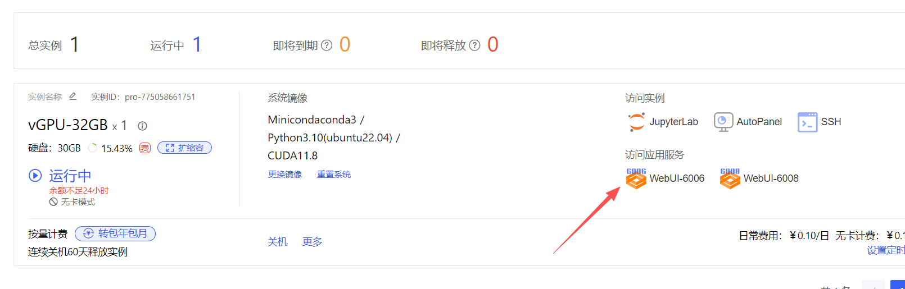

# 运行项目                                                                                                                                                                                                           
`curl -fsSL https://deb.nodesource.com/setup_24.x | bash -
apt-get install -y nodejs `
`
apt-get update                                                                                                                                                                                                                    
apt-get install -y python3 make g++
`                                                                                                                                                                                     
                                                                                                                                                                                                                                    
`
cd ~/Toonflow-game                                                                                                                                                                                                                
yarn install                                                                                                                                                                                                                      
npm install -g pm2
`                                                                                                                                                                                                           
                                                                                                                                                                                                                                    
  然后不要先用 yarn build，直接用下面这组更稳：                                                                                                                                                                                     
                                                                                                                                                                                                                                    
`  
cd ~/Toonflow-game                                                                                                                                                                                                                
NODE_ENV=prod PREFER_PROCESS_ENV=1 npx tsx scripts/build.ts                                                                                                                                                                      
NODE_ENV=prod PREFER_PROCESS_ENV=1 pm2 start build/app.js --name toonflow-app --update-env                                                                                                                                                                       
pm2 save
`                                                                                                                                                                                                                   
                                                                                                                                                                                                                                    
  再检查：                                                                                                                                                                                                                          
                                                                                                                                                                                                                                    
  pm2 logs toonflow-app                                                                                                                                                                                                             
  curl http://127.0.0.1:60002/

  如果 yarn install 这一步又报错，把完整报错贴我。
  如果是 esbuild 找不到，我再给你下一条修正命令。
  curl http://127.0.0.1:60002/

  如果 yarn install 这一步又报错，把完整报错贴我。
  如果是 esbuild 找不到，我再给你下一条修正命令。

#
```
mkdir -p /var/www/toonflow                                                                                                                                                                                                        
rsync -a --delete /root/Toonflow-game/scripts/web/ /var/www/toonflow/                                                                                                                                                             
chown -R www-data:www-data /var/www/toonflow                                                                                                                                                                                      
chmod -R 755 /var/www/toonflow
sed -i 's#root /root/Toonflow-game/scripts/web;#root /var/www/toonflow;#' /etc/nginx/sites-enabled/toonflow                                                                                                                       
nginx -t && service nginx reload                                                                                                                                                                                                  
curl -I http://127.0.0.1:6006/         `                                                                      
```

## 安卓端怎么配                                                                                                                                                                                                                   
                                                                                                                                                                               
安卓端的 baseUrl 直接填：                                                                                                                                                                                                         
                                                                                                                                                                                                                                  
https://u904865-775058661751.bjb1.seetacloud.com:8443/

OSSURL=https://u904865-775058661751.bjb1.seetacloud.com:8443/    