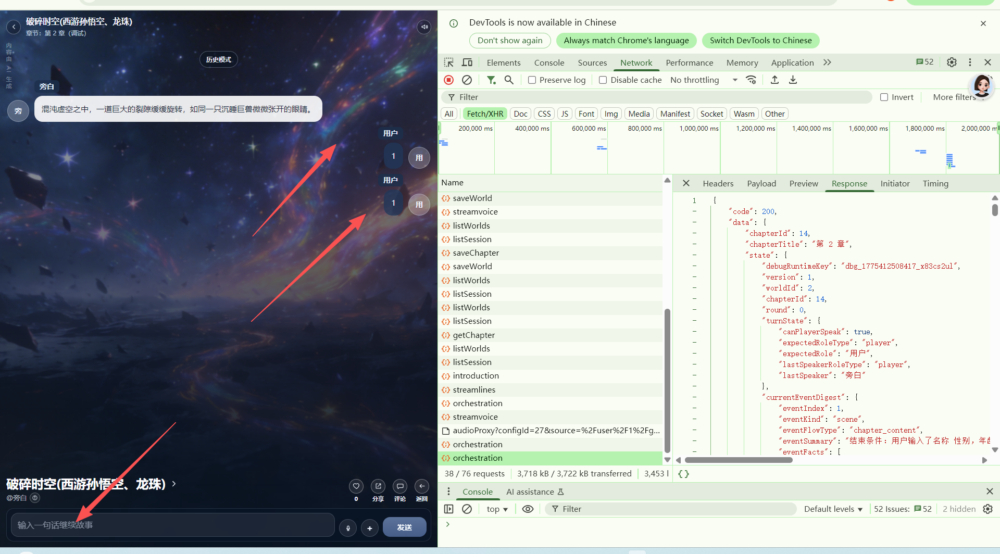

# no_modify
[app-2026-04-06.1.log](../../../../../../../logs/app-2026-04-06.1.log)
# [suc] “解决方案，进入调试的工作过界了”
    [test.V2.chapters_debug.md](../test.V2.chapters_debug.md) 的“解决方案，进入调试的工作过界了”
   保存草稿-》加载完-》（第一章的话开场白）-》编排-》台词->播放
这个没有完成。
   目前出现的问题。
    
    
streamvoice->audioProxy->saveWorld->streamvoice->listWorlds->listSession->saveChapter->saveWorld->listWorlds->listSession->listWorlds->listSession->getChapter->listWorlds->listSession->introduction->streamlines->orchestration
首先“streamvoice->audioProxy->saveWorld->streamvoice->listWorlds->listSession->saveChapter->saveWorld->listWorlds->listSession->listWorlds->listSession->getChapter->listWorlds->listSession”
这一堆是啥？？？？
正确流程是：保存草稿-》加载完-》（第一章的话有开场白）-》编排-》台词->播放
无论如何在introduction前就应该属于加载完。
而且saveWorld 出现了两次streamvoice出现了两次，listWorlds 和listWorlds出现了四次？
要求去掉重复请求！或者合并“加载完”请求为 游玩：“/initStory” 调试:"/initDebug"
# [suc] 开场白没有独立于第一章章节内容
[test_V3.1.md](../test/TEST_V3/test_V3.1.md)

# [fail] 事件混乱
[test_V3.1.md](../test/TEST_V3/test_V3.1.md) 的
“章节内容的事件和结束条件的事件分离开！每个事件都有开始-经过-结束的过程。”

无故事件被标记为已完成。

# [fail] 回溯功能

# [fail] "[tag_end_chapter]" 没有看见,结束判断混乱
[test_V3.md](../test/TEST_V3/test_V3.md) 的“[tag_end_chapter]”

# [fail] 事件混乱也导致了编排混乱

# [fail] "[story:orchestrator:runtime]" 的日志没有记录返回了什么，推理的消耗token

# [fail] "章节结束条件必须判定出接口不能直接跳过!!! 未结束/失败/成功 "

因为目前事件混乱导致无法正常调试

# [fail] [test.V2.md](../test/test.V2.md) 的“AI故事-剧情编排(精简版)checkbox ,AI故事-剧情编排(高级版)checkbox”

现在没有办法看到和修改高级版 的提示词内容。