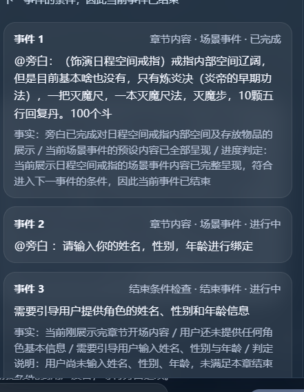

# no_modify
## [suc] 角色发言乱飞
[h1.log](h1.log)
- 事件索引增加引导事件时，是在结束事件前面插入的
- 发言时从当前事件获取台词：如
动机中:@旁白：请输入你的姓名，性别，年龄进行绑定， 意思是要旁白说这句话。
把章节内容也发送到大模型
- 事件阶段的来源？
### [fail] 用户发言后没有 卡在“正在生成下一句内容...”
 [Image #1] 用户说话后，进行编排。[Image #2] {"code":200,"data":{"role":"旁白","motive":"确认异天的角色信息并完成角色绑定"},"message":"成功"} 然后就一直卡在“正在生成下一句内容...” 没有去生成台词[@logs/app-2026-04-14.1.log]     
  [@logs/event_log/app-2026-04-14.event_chain.summary.md][@md/plan/ai_game/V3/游玩业务/V4/info2.md:3-14]
  期望的效果是，第一明显已经达到章节结束条件。 第二就算没有达到也应该下一个编排下一个角色说话。不应该一直卡在“正在生成下一句内容...” 第三[Image #3] 这个面板的信息非常混乱。下一个为什么是用户？phase 怎么就显示了下个章节的？      
  [Image #4] 章节1 的事件怎么这样乱七八遭的 全都是未开始？ 事件 1章节内容 · 场景事件 · 等待用户 。等待个屁用户。哪里来的等待用户。正常来说是三个事件都结束了才对。
- [fail] 用户说话后，要进行编排和生成台词
- [fail] 达到章节结束条件要进入下一个章节
- [fail] 前端的这个面板的信息非常混乱。下一个为什么是用户？phase 怎么就显示了下个章节的？

- [fail] 章节的事件状态流转异常
章节1 的事件怎么这样乱七八遭的 全都是未开始？ 事件 1章节内容 · 场景事件 · 等待用户 。等待个屁用户。哪里来的等待用户。正常来说是三个事件都结束了才对。
    