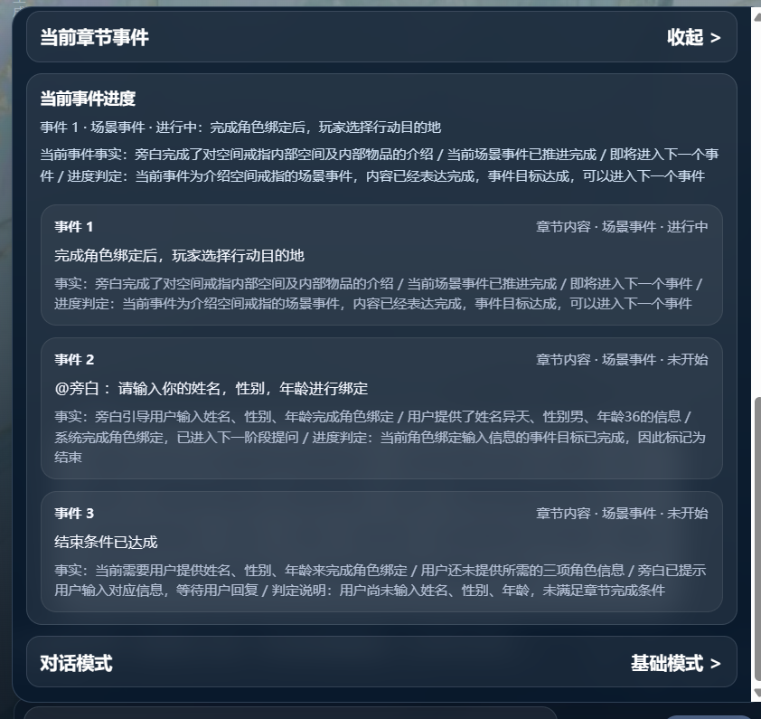
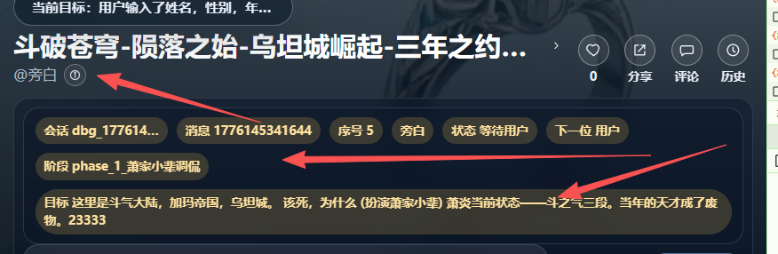
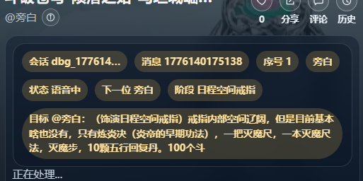

# no_modify
[@logs/event_log/app-2026-04-14.event_chain.summary.md]
[@md/plan/ai_game/V3/游玩业务/V4/info2.md:3-14]
[app-2026-04-14.2.log](../../../../../../logs/app-2026-04-14.2.log)
## [suc] 角色发言乱飞
[h1.log](h1.log)
- 事件索引增加引导事件时，是在结束事件前面插入的
- 发言时从当前事件获取台词：如
动机中:@旁白：请输入你的姓名，性别，年龄进行绑定， 意思是要旁白说这句话。
把章节内容也发送到大模型
- 事件阶段的来源？
### [fail] 用户发言后没有 卡在“正在生成下一句内容...”
 [Image #1] 用户说话后，进行编排。[Image #2] {"code":200,"data":{"role":"旁白","motive":"确认异天的角色信息并完成角色绑定"},"message":"成功"} 然后就一直卡在“正在生成下一句内容...” 没有去生成台词[@logs/app-2026-04-14.1.log]     
  
  期望的效果是，第一明显已经达到章节结束条件。 第二就算没有达到也应该下一个编排下一个角色说话。不应该一直卡在“正在生成下一句内容...” 第三[Image #3] 这个面板的信息非常混乱。下一个为什么是用户？phase 怎么就显示了下个章节的？      
  [Image #4] 章节1 的事件怎么这样乱七八遭的 全都是未开始？ 事件 1章节内容 · 场景事件 · 等待用户 。等待个屁用户。哪里来的等待用户。正常来说是三个事件都结束了才对。
- [suc] 用户说话后，要进行编排和生成台词
- [fail] 达到章节结束条件要进入下一个章节

- [fail] 前端的这个面板的信息非常混乱。下一个为什么是用户？phase 怎么就显示了下个章节的？
  - [suc] 下一个为什么是用户,已合理，这一轮用户是合理的
  - [fail] phase 怎么就显示了下个章节的？


- [fail] 章节的事件状态流转异常
章节1 的事件怎么这样乱七八遭的.
  (old1):全都是未开始？ 事件 1章节内容 · 场景事件 · 等待用户 。等待个屁用户。哪里来的等待用户。正常来说是三个事件都结束了才对。
new:
- 

当前事件；
```
事件 1
章节内容 · 场景事件 · 进行中
异天进入乌坦城坊市，需选择查看的摊位
事实：["异天完成角色绑定进入乌坦城坊市", "街口药材摊摆着新鲜紫河车"]
事件 2
章节内容 · 场景事件 · 未开始
@旁白 ：请输入你的姓名，性别，年龄进行绑定
事实：用户已完成姓名性别年龄的角色绑定 / 旁白推进剧情至乌坦城坊市场景 / 旁白向用户提问当前打算先看哪一家 / 尚未获取用户对该问题的回复 / 进度判定：当前事件仍在推进，已抛出问题需要用户给出选择输入，事件尚未完成
事件 3
章节内容 · 场景事件 · 未开始
结束条件已达成
事实：当前需要用户提供姓名、性别、年龄来完成角色绑定 / 用户还未提供所需的三项角色信息 / 旁白已提示用户输入对应信息，等待用户回复 / 判定说明：用户尚未输入姓名、性别、年龄，未满足章节完成条件
```
异天进入乌坦城坊市，需选择查看的摊位 这个事件是哪里来的。
正常情况是全部事件完结然后进入下一个章节才对。