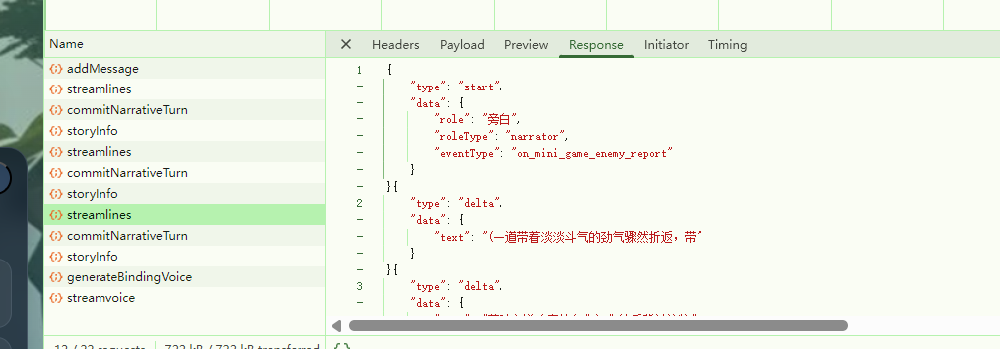

这是ai 分析
[h3.analyze.md](h3.analyze.md) 
我的点评：不知所谓
# 依然没有分析出为什么第一个没有语音
1. 问题1 这是谁返回的？
[2026-05-05 15:44:39.309] [LOG] [ai:text:http] response {"label":"volcengine:doubao-seed-2-0-mini-260215","method":"POST","url":"https://ark.cn-beijing.volces.com/api/v3/chat/completions","status":200,"costMs":1397,"headers":{"content-encoding":"gzip","content-length":"530","content-type":"application/json; charset=utf-8","date":"Tue, 05 May 2026 07:44:43 GMT","server":"istio-envoy","vary":"Accept-Encoding","x-client-request-id":"unknown-20260505154442-eCdfzAWi","x-envoy-upstream-service-time":"1332","x-request-id":"02177796708261266d4fff57f472cc97f9dc7178d7aa5269a9fb7"},"body":"{\"choices\":[{\"finish_reason\":\"stop\",\"index\":0,\"logprobs\":null,\"message\":{\"content\":\"(一道带着劲风的步法残影闪过，异天的攻击擦着萧炎的衣摆扫过，只留下一道浅浅的划痕，萧炎闷哼一声，气血翻涌间血量掉到了72点。)\\n@萧炎：“哼，倒是有点本事……”\",\"role\":\"assistant\"}}],\"created\":1777967083,\"id\":\"02177796708261266d4fff57f472cc97f9dc7178d7aa5269a9fb7\",\"model\":\"doubao-seed-2-0-mini-260215\",\"service_tier\":\"default\",\"object\":\"chat.completion\",\"usage\":{\"completion_tokens\":58,\"prompt_tokens\":1205,\"total_tokens\":1263,\"prompt_tokens_details\":{\"cached_tokens\":0},\"completion_tokens_details\":{\"reasoning_tokens\":0}}}"}
角色发言agent
为什么出现问题？
修改agent 提示词
`"# 规则：\n" +
"## “@角色名: xxx” 代表角色要说这个台词\n"+
"## “@角色名 xxx” 代表角色要做这件事，台词发挥较为自由一点\n" `
为
```
"# 规则：\n" +
"## 入参：\n" +
"### “@角色名: xxx” 代表角色要说这个台词\n"+
"### “@角色名 xxx” 代表角色要做这件事，台词发挥较为自由一点\n"+
"## 输出要求：\n" +
"###  不要“@角色名: xxx”  直说说自己的台词“xxxxx”就好，提到别人直接说“角色xxx” \n"+
```
我已修改

2.问题2 没有播放语音
先分析 /voice/audioProxy 如何触发的
战斗模式没有根据要求走的编排接口而是

而是直接走的game/streamlines
[review.md](../review.md)要求走的/game/orchestration/ 那么就改一下走独立的/game/orchestration/minigame
必须走一下编排流程避免流程的缺少。导致的问题
改为下面的流程:
编排agent（/game/orchestration/minigame）-》发言agent（/game/streamlines）-》播放语音-预热（/game/streamvoice）-》播放语音-播放（/voice/audioProxy）

