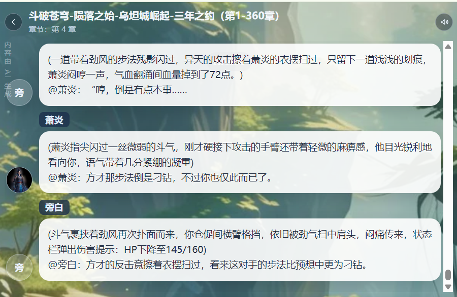
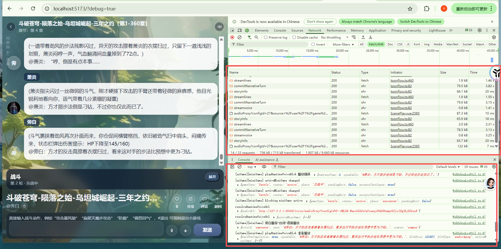

# 台词：
- 旁白说：
(一道带着劲风的步法残影闪过，异天的攻击擦着萧炎的衣摆扫过，只留下一道浅浅的划痕，萧炎闷哼一声，气血翻涌间血量掉到了72点。)
@萧炎：“哼，倒是有点本事……
- 语音没有播放，没有触发 /voice/audioProxy

- 萧炎说：
(萧炎指尖闪过一丝微弱的斗气，刚才硬接下攻击的手臂还带着轻微的麻痹感，他目光锐利地看向你，语气带着几分紧绷的凝重)
@萧炎：方才那步法倒是刁钻，不过你也仅此而已了。
- 语音播放，触发了/voice/audioProxy

- 旁白说：
(斗气裹挟着劲风再次扑面而来，你仓促间横臂格挡，依旧被劲气扫中肩头，闷痛传来，状态栏弹出伤害提示：HP下降至145/160)
@旁白：方才的反击竟擦着衣摆扫过，看来这对手的步法比预想中更为刁钻。

# 问题点
- 第一次播报回合为什么没有语音
- “@萧炎：” 不应该出现在台词里。
正确的台词设计
- 用户回合：输入内容
- 旁白说：
一道带着劲风的步法残影闪过，异天的攻击擦着萧炎的衣摆扫过，只留下一道浅浅的划痕，萧炎闷哼一声，气血翻涌间血量掉到了72点。

- 语音播放，触发 /voice/audioProxy

- 萧炎说：
(萧炎指尖闪过一丝微弱的斗气，刚才硬接下攻击的手臂还带着轻微的麻痹感，他目光锐利地看向你，语气带着几分紧绷的凝重)
方才那步法倒是刁钻，不过你也仅此而已了。看招，八极崩。
- 语音播放，触发了/voice/audioProxy

- 旁白说：
(斗气裹挟着劲风再次扑面而来，你仓促间横臂格挡，依旧被劲气扫中肩头，闷痛传来，状态栏弹出伤害提示：HP下降至145/160)
方才的反击竟擦着衣摆扫过，看来这对手的步法比预想中更为刁钻。

- 用户回合, 回合制到敌方或者用户血量为零。 或者“#退出” 