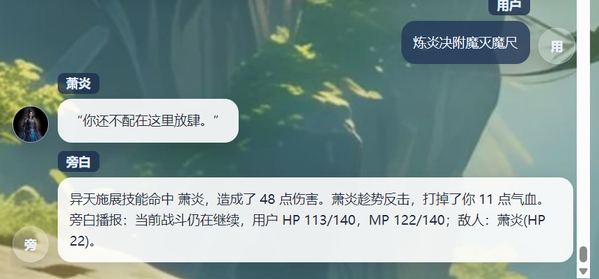

# no_modify
# 小游戏
## [fail] 小游戏设计的不友好性
## 先来看看战斗小游戏
[app-2026-05-03.2.log](app-2026-05-03.2.log)
[app-2026-05-03.mini_game.summary.md](event_log/app-2026-05-03.mini_game.summary.md)

 战斗小游戏设计
[战斗.md](../../V3/%E5%B0%8F%E6%B8%B8%E6%88%8F%E8%AE%BE%E8%AE%A1/%E6%88%98%E6%96%97.md)
这里的设计比较粗略。而ai 生成的也非常简陋

### 分析
- /game/addMessage[炼炎决附魔灭魔尺]
日志中看到
[story:mini_game:agent]: AI故事-小游戏agent 日志
[story:mini_game:stats]: AI故事-小游戏agent token 统计
  - 问题点：
    - [story:mini_game:stats] 的 日志非常简陋,请参考[story:streamlines:stats] 进行设计 打印真正的token 统计
    和返回内容日志打印
    - 需要DebugLogUtil.isDebugLogEnabled() 才打印[story:mini_game:agent] 和 [story:mini_game:stats] 日志
- 我猜这是大模型返回的内容
```
[2026-05-03 17:11:54.987] [LOG] [ai:text:http] request {"label":"volcengine:doubao-seed-2-0-lite-260215","method":"POST","url":"https://ark.cn-beijing.volces.com/api/v3/chat/completions","headers":{"authorization":"Bearer 23a9***772a","content-type":"application/json","user-agent":"ai/6.0.67 ai-sdk/provider-utils/4.0.13 runtime/node.js/22"},"body":"{\"model\":\"doubao-seed-2-0-lite-260215\",\"reasoning_effort\":\"minimal\",\"messages\":[{\"role\":\"system\",\"content\":\"\\n请按照以下 JSON Schema 格式返回结果:\\n{\\n  \\\"$schema\\\": \\\"https://json-schema.org/draft/2020-12/schema\\\",\\n  \\\"type\\\": \\\"object\\\",\\n  \\\"properties\\\": {\\n    \\\"action_id\\\": {\\n      \\\"type\\\": \\\"string\\\",\\n      \\\"description\\\": \\\"最终识别出的程序动作 id，必须来自 legal_actions\\\"\\n    },\\n    \\\"target_name\\\": {\\n      \\\"type\\\": \\\"string\\\",\\n      \\\"description\\\": \\\"若输入里包含明确目标对象，则返回目标名称；否则为空串\\\"\\n    },\\n    \\\"reason\\\": {\\n      \\\"type\\\": \\\"string\\\",\\n      \\\"description\\\": \\\"简短说明为什么这样识别\\\"\\n    }\\n  },\\n  \\\"required\\\": [\\n    \\\"action_id\\\",\\n    \\\"target_name\\\",\\n    \\\"reason\\\"\\n  ],\\n  \\\"additionalProperties\\\": false\\n}\\n只返回结果，不要将Schema返回。\"},{\"role\":\"system\",\"content\":\"你是战斗小游戏动作解析器。## 重点识别攻击、技能攻击、防御、调息回气、查看状态，以及用户提到的敌人目标名称。## 规则：\\n### 血量和蓝的恢复：住宿和吃下恢复药物等可以恢复血量和蓝\\n### 满血：基础血量100 + 等级*10 + 特殊物品或者技能加成，如物品里的血量属性点(2)\\n### 满蓝：基础蓝量100 + 等级*10 + 特殊物品或者技能加成，如物品里的蓝量属性点(2)\\n### 攻击力：基础攻击力10 + 等级*10 + 特殊物品或者技能加成，如物品里的攻击点属性点(2)\\n### 防御力：基础防御1 + 等级*10 + 特殊物品或者技能加成，如物品里的防御点属性点(2)\\n像“乾坤大挪移钓法”这种明显不属于战斗语境的说法不要误判为战斗动作。\"},{\"role\":\"user\",\"content\":\"{\\n  \\\"game_type\\\": \\\"battle\\\",\\n  \\\"phase\\\": \\\"encounter\\\",\\n  \\\"status\\\": \\\"active\\\",\\n  \\\"public_state_summary\\\": \\\"用户 HP 124/140，MP 140/140；敌人：萧炎(HP 70)。\\\",\\n  \\\"latest_narration\\\": \\\"“你还不配在这里放肆。”异天挥出攻击命中 萧炎，造成了 30 点伤害。萧炎趁势反击，打掉了你 16 点气血。旁白播报：当前战斗仍在继续，用户 HP 124/140，MP 140/140；敌人：萧炎(HP 70)。\\\",\\n  \\\"legal_actions\\\": [\\n    {\\n      \\\"action_id\\\": \\\"attack\\\",\\n      \\\"label\\\": \\\"普通攻击\\\",\\n      \\\"desc\\\": \\\"对当前目标或指定目标发起普通攻击\\\",\\n      \\\"aliases\\\": [\\n        \\\"攻击\\\",\\n        \\\"平A\\\",\\n        \\\"普通攻击\\\",\\n        \\\"砍他\\\",\\n        \\\"打他\\\"\\n      ]\\n    },\\n    {\\n      \\\"action_id\\\": \\\"skill\\\",\\n      \\\"label\\\": \\\"技能攻击\\\",\\n      \\\"desc\\\": \\\"施展功法、斗技或技能攻击目标\\\",\\n      \\\"aliases\\\": [\\n        \\\"技能\\\",\\n        \\\"施展技能\\\",\\n        \\\"施展斗技\\\",\\n        \\\"用功法打\\\",\\n        \\\"放技能\\\"\\n      ]\\n    },\\n    {\\n      \\\"action_id\\\": \\\"guard\\\",\\n      \\\"label\\\": \\\"防御\\\",\\n      \\\"desc\\\": \\\"本回..."}
[2026-05-03 17:11:57.816] [LOG] [ai:text:http] response {"label":"volcengine:doubao-seed-2-0-lite-260215","method":"POST","url":"https://ark.cn-beijing.volces.com/api/v3/chat/completions","status":200,"costMs":2828,"headers":{"content-encoding":"gzip","content-length":"475","content-type":"application/json; charset=utf-8","date":"Sun, 03 May 2026 09:11:59 GMT","server":"istio-envoy","vary":"Accept-Encoding","x-client-request-id":"unknown-20260503171157-NJKnWZmL","x-envoy-upstream-service-time":"2647","x-request-id":"021777799517275d58ccb193909ed7cf536102523f820e7bd9f75"},"body":"{\"choices\":[{\"finish_reason\":\"stop\",\"index\":0,\"logprobs\":null,\"message\":{\"content\":\"{\\n  \\\"action_id\\\": \\\"skill\\\",\\n  \\\"target_name\\\": \\\"萧炎\\\",\\n  \\\"reason\\\": \\\"炼炎决是功法，灭魔尺是战斗武器，该输入是使用功法技能攻击敌人萧炎，属于技能攻击动作\\\"\\n}\",\"role\":\"assistant\"}}],\"created\":1777799519,\"id\":\"021777799517275d58ccb193909ed7cf536102523f820e7bd9f75\",\"model\":\"doubao-seed-2-0-lite-260215\",\"service_tier\":\"default\",\"object\":\"chat.completion\",\"usage\":{\"completion_tokens\":55,\"prompt_tokens\":1019,\"total_tokens\":1074,\"prompt_tokens_details\":{\"cached_tokens\":0},\"completion_tokens_details\":{\"reasoning_tokens\":0}}}"}
[2026-05-03 17:11:57.823] [LOG] [ai:text:usage] {"type":"小游戏动作解析","manufacturer":"volcengine","model":"doubao-seed-2-0-lite-260215","channel":"volcengine","inputTokens":1019,"outputTokens":55,"reasoningTokens":0,"cacheReadTokens":0,"totalTokens":1074,"reasoningEffort":"minimal","remark":"battle"}
[2026-05-03 17:11:57.829] [LOG] [ai:text] invoke:success {"manufacturer":"volcengine","model":"doubao-seed-2-0-lite-260215","costMs":2852,"textLength":106,"textPreview":"{\n  \"action_id\": \"skill\",\n  \"target_name\": \"萧炎\",\n  \"reason\": \"炼炎决是功法，灭魔尺是战斗武器，该输入是使用功法技能攻击敌人萧炎，属于技能攻击动作\"\n}","hasObject":false,"warningsCount":0}
[2026-05-03 17:11:57.831] [LOG] [ai:text] invoke:parsedObject {"candidateCount":1,"hasResult":true}
```


涉及的agent:
小游戏动作解析 agent
你是战斗小游戏动作解析器。

特别注意：你还不配在这里放肆。”异天挥出攻击命中 萧炎，造成了 30 点伤害。萧炎趁势反击，打掉了你 16 点气血。旁白播报：当前战斗仍在继续
这句不知道哪里的。 而且流畅很奇怪。

## [fail] [story:mini_game:stats] 的 日志非常简陋,请参考[story:streamlines:stats] 进行设计 打印真正的token 统计
