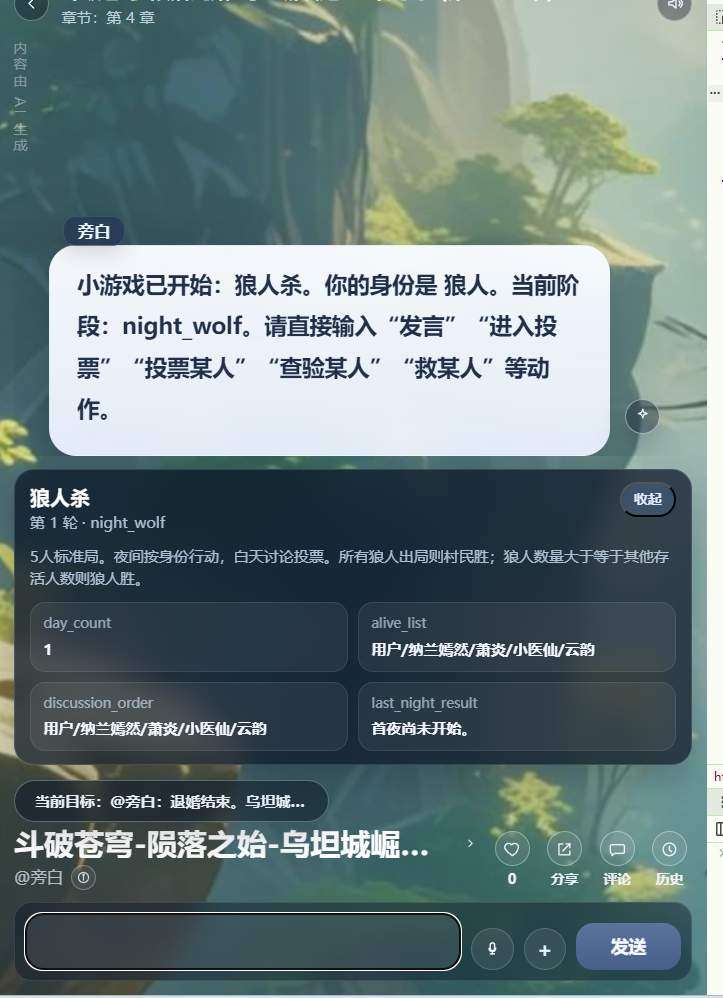

[小游戏设计.md](../V3/%E5%B0%8F%E6%B8%B8%E6%88%8F%E8%AE%BE%E8%AE%A1/%E5%B0%8F%E6%B8%B8%E6%88%8F%E8%AE%BE%E8%AE%A1.md)

# 小游戏狼人杀
小游戏狼人杀 问题：

用户默认永远是狼人
MiniGameController.ts (line 1380) 的 buildParticipants 会把用户放第一位，MiniGameController.ts (line 2459) 又按 ["狼人", "预言家", "女巫", "村民", "村民"] 顺序分配身份，所以默认用户每局都是狼人。这对狼人杀不成立。

NPC 夜晚流程不完整
MiniGameController.ts (line 1620) 只是预先设置 wolf_target，但如果用户不是狼人，NPC 狼人的击杀没有稳定结算到死亡列表。预言家、女巫视角下的夜晚闭环是不完整的。

女巫药次数没有真正限制
witch_save_used / witch_poison_used 有字段，但 MiniGameController.ts (line 1549) 的选项和 MiniGameController.ts (line 1831) 的执行逻辑没有严格拦截重复用药。

白天/夜晚胜负检查不完整
胜负主要在 MiniGameController.ts (line 1787) 投票后判断。夜晚击杀、女巫毒杀后没有立即统一检查胜负，可能出现已经满足胜负条件但继续进入白天的情况。

用户出局旁观模式没做好
设计文档要求“用户提前出局后旁观到结束”，但当前 werewolfOptions 没有基于用户是否存活限制发言/投票。
