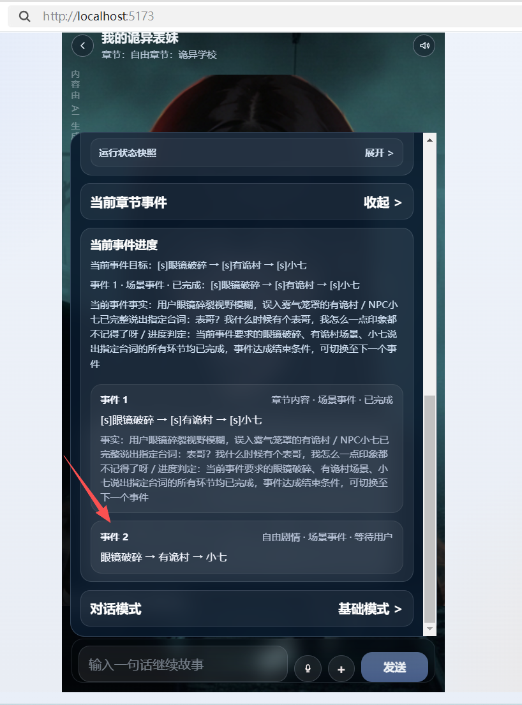

# no_modify
# 章节内容
```
## 回乡
### 眼镜破碎
@旁白：你有千度近视，而你在找村口的时候弄坏了眼镜
### 有诡村
@旁白：你搞错了入口，本来是要去游桂村
去到了有诡村，并且误以为小七是不表妹
### 小七
@小七：表哥？我什么时候有个表哥，不记得了。

## 非事件:任务分类（只是提供给旁白用来推荐任务）

### 生存类
- 收集止血草与基础药材
- 寻找临时修炼地点
- 避开城外魔兽巡游区
- 修复破损装备
- 获取基础食物资源
- 侦测周围危险气息
- 躲避强者气息压制
- 建立临时落脚点
- 处理夜间威胁
- 维持体力与状态

### 调查类
- 寻找失踪的同学
- 校长的邀请函
- 半夜的钢琴声
- 小七的日记
- 食堂的奇怪菜单
- 厕所里的第三格
- 图书馆的禁书区
- 校医院的深夜急诊
- 小七的"朋友"
- 运动会的奇怪项目

### 社交类
- 和苏老师交谈
- 向校长请教
- 和小七聊天
- 结识新同学
- 参加学校活动
- 加入社团
- 与路人甲互动
- 向诡异求助
- 与人类学生结盟
- 建立信任关系

### 战斗类
- 对抗低阶诡异
- 躲避裂口女
- 逃离无面人
- 抵抗长发女
- 与校长对峙
- 保护人类学生
- 反击诡异攻击
- 使用运气技能逃生
- 捏碎护身符保命
- 寻找武器自卫

### 剧情类
- 发现小七的真实身份
- 揭开学校的秘密
- 找到离开的方法
- 了解诡异世界的规则
- 触发核心剧情事件
- 解锁隐藏结局
- 收集关键线索
- 解开表妹的谜团
- 面对最终真相
- 做出命运抉择
```

```
{
  "openingMessages": [
    {
      "role": "旁白",
      "roleType": "narrator",
      "content": "用户本以为这只是一次普通的回乡探亲。表妹小七，和用户从小一起长大，乖巧、安静，笑起来有个浅浅的酒窝。用户已经有三年没见她了。火车驶入那座被浓雾笼罩的小镇时，用户隐约觉得哪里不对。站台上的工作人员笑容僵硬，嘴角的弧度完全一致。接用户的小七确实长着那张熟悉的脸，可当你们走过站台柱子时，用户余光瞥见——她的影子，在灯光照不到的地方，分成了三道。"
    }
  ],
  "phases": [
    {
      "id": "phase_1_回乡",
      "label": "回乡",
      "kind": "scene",
      "targetSummary": "眼镜破碎 → 有诡村 → 小七",
      "stages": [
        {
          "id": "phase_1_回乡_stage_1_眼镜破碎",
          "label": "眼镜破碎",
          "kind": "scene",
          "targetSummary": "@旁白：你有千度近视，而你在找村口的时候弄坏了眼镜",
          "userNodeId": null,
          "body": "@旁白：你有千度近视，而你在找村口的时候弄坏了眼镜"
        },
        {
          "id": "phase_1_回乡_stage_2_有诡村",
          "label": "有诡村",
          "kind": "scene",
          "targetSummary": "@旁白：你搞错了入口，本来是要去游桂村\n去到了有诡村，并且误以为小七是不表妹",
          "userNodeId": null,
          "body": "@旁白：你搞错了入口，本来是要去游桂村\n去到了有诡村，并且误以为小七是不表妹"
        },
        {
          "id": "phase_1_回乡_stage_3_小七",
          "label": "小七",
          "kind": "scene",
          "targetSummary": "@小七：表哥？我什么时候有个表哥，不记得了。",
          "userNodeId": null,
          "body": "@小七：表哥？我什么时候有个表哥，不记得了。"
        }
      ],
      "userNodeId": null,
      "allowedSpeakers": [],
      "nextPhaseIds": [],
      "defaultNextPhaseId": null,
      "requiredEventIds": [],
      "completionEventIds": [],
      "advanceSignals": [
        "事件标题：回乡",
        "@旁白：你有千度近视，而你在找村口的时候弄坏了眼镜",
        "@旁白：你搞错了入口，本来是要去游桂村",
        "@小七：表哥？我什么时候有个表哥，不记得了。"
      ],
      "relatedFixedEventIds": []
    }
  ],
  "userNodes": [],
  "fixedEvents": [],
  "endingRules": {
    "success": [],
    "failure": [],
    "nextChapterId": null
  }
}
```
# 自由章节的事件1 鬼打墙事件
[app-2026-06-01.01.log](../../../../../logs/app-2026-06-01.01.log)

[2026-06-01 11:11:54.692] [LOG] [story:event_progress:stats] | 输入摘要 | current_event=1/active ↩ phase= ↩ next_event=0/ ↩ latest_role=用户/on_message ↩ recent_dialogue_count=4 | - | - |
[2026-06-01 11:11:54.693] [LOG] [story:event_progress:stats] | 解析结果 | ended=true ↩ event_status=completed ↩ progress_summary=自由行动场景下用户已作出回应，该自由引导事件已完成 ↩ reason=该事件目标是引导用户在诡异校园门口进行自由行动并等待用户发言回应，用户已完成发言交互，满足事件结束条件 | - | - |
[2026-06-01 11:11:54.693] [LOG] [story:event_progress:stats] | 区块 | 实际内容 | 字符数 | 估算 Tokens |
[2026-06-01 11:11:54.694] [LOG] [story:event_progress:stats] | System Prompt | 你是事件进度检测器。你只判断“当前事件是否结束、现在进行到哪一步”，不判断章节是否成功或失败。

明显已经结束了事件

[app-2026-06-01.01.event_chain.summary.md](../../../../../logs/event_log/app-2026-06-01.01.event_chain.summary.md)
这里一直显示没有结束

前端更离谱直接出现事件2



# /game/storyInfo 返回的内容摘要
```
"currentEventDigest": {
            "eventIndex": 1,
            "eventKind": "scene",
            "eventFlowType": "chapter_content",
            "eventSummary": "[s]眼镜破碎 → [s]有诡村 → [s]小七",
            "eventFacts": [
                "用户眼镜碎裂视野模糊，误入雾气笼罩的有诡村",
                "NPC小七已完整说出指定台词：表哥？我什么时候有个表哥，我怎么一点印象都不记得了呀",
                "进度判定：当前事件要求的眼镜破碎、有诡村场景、小七说出指定台词的所有环节均已完成，事件达成结束条件，可切换至下一个事件"
            ],
            "eventStatus": "completed",
            "summarySource": "ai",
            "memorySummary": "",
            "memoryFacts": [],
            "updateTime": 1780293549017,
            "allowedRoles": [],
            "userNodeId": "",
            "stageProgress": {
                "phaseId": "phase_1_回乡",
                "phaseLabel": "回乡",
                "stages": [
                    {
                        "index": 0,
                        "label": "眼镜破碎",
                        "status": "s"
                    },
                    {
                        "index": 1,
                        "label": "有诡村",
                        "status": "s"
                    },
                    {
                        "index": 2,
                        "label": "小七",
                        "status": "s"
                    }
                ]
            }
        },
        "eventDigestWindow": [
            {
                "eventIndex": 1,
                "eventKind": "scene",
                "eventFlowType": "chapter_content",
                "eventSummary": "[s]眼镜破碎 → [s]有诡村 → [s]小七",
                "eventFacts": [
                    "用户眼镜碎裂视野模糊，误入雾气笼罩的有诡村",
                    "NPC小七已完整说出指定台词：表哥？我什么时候有个表哥，我怎么一点印象都不记得了呀",
                    "进度判定：当前事件要求的眼镜破碎、有诡村场景、小七说出指定台词的所有环节均已完成，事件达成结束条件，可切换至下一个事件"
                ],
                "eventStatus": "completed",
                "summarySource": "ai",
                "memorySummary": "",
                "memoryFacts": [],
                "updateTime": 1780293549017,
                "allowedRoles": [],
                "userNodeId": "",
                "stageProgress": {
                    "phaseId": "phase_1_回乡",
                    "phaseLabel": "回乡",
                    "stages": [
                        {
                            "index": 0,
                            "label": "眼镜破碎",
                            "status": "s"
                        },
                        {
                            "index": 1,
                            "label": "有诡村",
                            "status": "s"
                        },
                        {
                            "index": 2,
                            "label": "小七",
                            "status": "s"
                        }
                    ]
                }
            },
            {
                "eventIndex": 2,
                "eventKind": "scene",
                "eventFlowType": "free_runtime",
                "eventSummary": "眼镜破碎 → 有诡村 → 小七",
                "eventFacts": [],
                "eventStatus": "waiting_input",
                "summarySource": "system",
                "memorySummary": "",
                "memoryFacts": [],
                "updateTime": 0,
                "allowedRoles": [],
                "userNodeId": "",
                "stageProgress": null
            }
        ],
        "eventDigestWindowText": "1. [chapter_content/scene/已完成] 眼镜破碎 → 有诡村 → 小七 | 事实:用户眼镜碎裂视野模糊，误入雾气笼罩的有诡村；NPC小七已完整说出指定台词：表哥？我什么时候有个表哥，我怎么一点印象都不记得了呀\n2. [free_runtime/scene/等待输入] 眼镜破碎 → 有诡村 → 小七",
        "allEventStageProgress": [
            {
                "phaseId": "phase_1_回乡",
                "phaseLabel": "回乡",
                "stages": [
                    {
                        "index": 0,
                        "label": "眼镜破碎",
                        "status": "s"
                    },
                    {
                        "index": 1,
                        "label": "有诡村",
                        "status": "s"
                    },
                    {
                        "index": 2,
                        "label": "小七",
                        "status": "s"
                    }
                ]
            }
        ],
```

## 问题解决
# [suc]在自由章节里。是否依然触发章节判定agent？
日志：前章节没有有效结束条件，跳过AI章节判定并沿用fallbackOutcome
# [fail]在自由章节里，最后一个事件都完成了，编排请求时，
会不会触发事件进度agent，编排师agent 会不会继续把最后一个事件当作当前事件。
或者把第一个事件当作当前事件？
