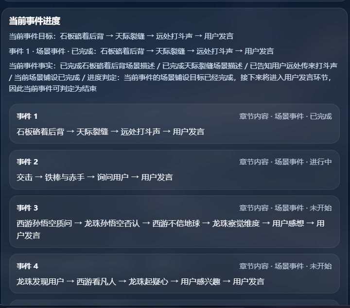

# no_modify
## 先来看看事件链分析的命令
yarn debug:event-chain logs/app-2026-05-20.log
```
# 事件链分析摘要
- 编排,current_event: 1 ,石板硌着后背 → 天际裂缝 → 远处打斗声 → 用户发言
  - sesesion_id: dbg_1779217409744_o2vw5f74
  - chapterTitle: 第 2 章
  - 返回了，role_type: narrator ↩ speaker: 旁白 ↩ motive: 补充交代远处打斗声的具体场景状态 ↩ await_user: false ↩ trigger_memory_agent: false ↩ event_adjust_mode: update ↩ event_status: active ↩ event_summary: 推进场景：展现远处打斗的状况，推进到用户发言前 ↩ event_facts: ↩ - 场景推进已到远处打斗声环节 ↩ - 即将进入用户发言环节
  - 记忆管理触发：false
  - 本轮动机，描述用户苏醒时被石板硌到后背的触感
  - 台词： 冰冷粗糙的石板硌着你的后背，陌生的硬触感让你猛地睁开眼，淡紫的天光落在头顶——遥远天际裂开一道漆黑缝隙，隐隐有金属碰撞的怒吼顺着风传过来。
  - 事件阶段：event_status=active，ended=false，progress_summary=当前已完成开场石板硌着后背的场景描述，正在推进到天际裂缝场景，当前事件尚未完成用户发言环节
  - 章节判定：result=continue，reason=当前仅完成场景描述第一步，尚未完成全部场景推进流程，也未让用户做出选择，不满足章节结束条件，guide_summary=需要继续推进场景描述，直到展示两位孙悟空的对峙情况，再引导用户做出跟随选择
  sessionStatus：active
  nextChapterId：

- 编排,current_event: 1 ,石板硌着后背 → 天际裂缝 → 远处打斗声 → 用户发言
  - sesesion_id: dbg_1779217409744_o2vw5f74
  - chapterTitle: 第 2 章
  - 返回了，role_type: ↩ narrator ↩ speaker: ↩ 旁白 ↩ motive: ↩ 描绘两道身影兵器交击的场景细节 ↩ await_user: ↩ false ↩ trigger_memory_agent: ↩ false ↩ event_adjust_mode: ↩ update ↩ event_status: ↩ active ↩ event_summary: ↩ 描绘两道金红身影兵器交击的场景 ↩ event_facts: ↩ 两道金红身影在裂谷尽头腾跃交错 ↩ 远处裂谷天际存在漆黑缝隙
  - 记忆管理触发：false
  - 本轮动机，补充交代远处打斗声的具体场景状态
  - 台词： 风卷着碎石从你身侧滚过，那碰撞怒吼越来越近，隐约能看见两道金红光影在裂谷尽头腾跃交错，气浪掀得整座山谷都在微微发颤。
  - 事件阶段：event_status=completed，ended=true，progress_summary=已完成场景推进，成功展现了远处打斗的状况，推进到了等待用户发言的节点
  - 章节判定：result=continue，reason=用户尚未做出选择，未满足本章结束条件，guide_summary=需要引导用户选择跟随西游孙悟空、龙珠孙悟空或者选择不站队
  sessionStatus：active
  nextChapterId：

- 编排,current_event: 2 ,交击 → 铁棒与赤手 → 询问用户 → 用户发言
  - sesesion_id: dbg_1779217409744_o2vw5f74
  - chapterTitle: 第 2 章
  - 返回了，role_type: ↩ narrator ↩ speaker: ↩ 旁白 ↩ motive: ↩ 展示两位孙悟空分开后的对峙场景 ↩ await_user: ↩ false ↩ trigger_memory_agent: ↩ false ↩ event_adjust_mode: ↩ keep ↩ event_status: ↩ active ↩ event_summary: ↩ 推进对峙流程，展现两位孙悟空的对峙姿态 ↩ event_facts: ↩ 两位孙悟空分开展开对峙，兵器相交后暂停 ↩ 地点是陌生裂谷，有淡紫色天光
  - 记忆管理触发：false
  - 本轮动机，描绘两道身影兵器交击的场景细节
  - 台词： 耀眼的金光与炽热的红芒在裂谷尽头炸开，金箍棒碰着如意棒撞得火星飞溅，每一次兵器相交都震得岩壁簌簌掉石，气浪顺着裂谷翻滚过来，掀得你鬓发都向后扬了起来。
  - 事件阶段：event_status=completed，ended=true，progress_summary=已完成两道金红身影兵器交击场景的描绘
  - 章节判定：result=continue，reason=用户还未选择跟随西游孙悟空、龙珠孙悟空或表示不站队，未满足本章完成条件，guide_summary=需要引导用户做出选择，选择跟随西游孙悟空、跟随龙珠孙悟空或者选择不站队
  sessionStatus：active
  nextChapterId：

- 编排,current_event: 3 ,西游孙悟空质问 → 龙珠孙悟空否认 → 西游不信地球 → 龙珠察觉维度 → 用户感想 → 用户发言
  - sesesion_id: dbg_1779217409744_o2vw5f74
  - chapterTitle: 第 2 章
  - 返回了，role_type: ↩ npc ↩ speaker: ↩ 西游孙悟空 ↩ motive: ↩ 对眼前的同名者发出质问，确认对方身份 ↩ await_user: ↩ false ↩ trigger_memory_agent: ↩ false ↩ event_adjust_mode: ↩ keep ↩ event_status: ↩ active ↩ event_summary: ↩ 两位孙悟空对峙，西游孙悟空率先质问对方身份 ↩ event_facts: ↩ 两位来自不同维度的孙悟空在裂谷对峙 ↩ 当前轮到西游孙悟空发起质问
  - 记忆管理触发：false
  - 本轮动机，展示两位孙悟空分开后的对峙场景
  - 台词： 轰鸣落定，气浪渐渐散开。两道身影各自向后跃开数步，稳稳站在了裂谷的两端——金箍棒与如意棒还各自斜斜架在半空，金棍映着红影，两位一模一样的孙悟空正遥遥对峙着。
  - 事件阶段：event_status=active，ended=false，progress_summary=当前处于对峙阶段的西游孙悟空质问环节，已完成开场场景铺陈，两位孙悟空已停下对峙站位，尚未推进到龙珠孙悟空否认环节
  - 章节判定：result=continue，reason=当前仍在自动推进场景剧情，尚未推进到最后用户发言环节，用户也未完成选择站队的操作，未满足章节结束条件，guide_summary=需要继续推进场景剧情，直到进入用户发言环节，之后引导用户选择跟随西游孙悟空、龙珠孙悟空或者选择不站队
  sessionStatus：active
  nextChapterId：

- 编排,current_event: 3 ,西游孙悟空质问 → 龙珠孙悟空否认 → 西游不信地球 → 龙珠察觉维度 → 用户感想 → 用户发言
  - sesesion_id: dbg_1779217409744_o2vw5f74
  - chapterTitle: 第 2 章
  - 返回了，role_type: ↩ npc ↩ speaker: ↩ 龙珠孙悟空 ↩ motive: ↩ 回应西游孙悟空的质问并察觉到用户存在 ↩ await_user: ↩ false ↩ trigger_memory_agent: ↩ false ↩ event_adjust_mode: ↩ keep ↩ event_status: ↩ active ↩ event_summary: ↩ 龙珠发现用户 → 西游看凡人 → 龙珠起疑心 → 用户感兴趣 → 用户发言 ↩ event_facts: ↩ 两位孙悟空在裂谷对峙,当前位于陌生裂谷之中
  - 记忆管理触发：false
  - 本轮动机，对眼前的同名者发出质问，确认对方身份
  - 台词： (金箍棒往地上一顿，震得碎石蹦起，火眼金睛死死锁着对面的红发猴子，雷公嘴扯出一声冷哼)哪来的毛猴，敢偷俺老孙的模样占俺的名号？报上你的来历！
  - 事件阶段：event_status=completed，ended=true，progress_summary=当前阶段西游孙悟空已完成质问，事件推进至下一阶段
  - 章节判定：result=continue，reason=用户尚未做出选择，未满足本章完成条件，guide_summary=需要引导用户选择跟随西游孙悟空、龙珠孙悟空或者选择不站队
  sessionStatus：active
  nextChapterId：
```
# 问题点1
`- 编排,current_event: 1 ,石板硌着后背 → 天际裂缝 → 远处打斗声 → 用户发言`
缺乏进度到哪里的显示
可以添加进度显示
状态：空->i->s->f  
空: 未开始
i: 进行中
s: 完成
f: 失败
`- 编排,current_event: 1 ,[I]石板硌着后背 → []天际裂缝 → []远处打斗声 → []用户发言`
相对的。
- agent 也能感知到这个进度变化。
- 页面上也能感知到这个进度变化。


```
- 事件 1
章节内容 · 场景事件 · 进行中
[I]石板硌着后背 → []天际裂缝 → []远处打斗声 → []用户发言
事件详细

- 事件 2
章节内容 · 场景事件 · 未开始
[]@路人甲: (饰演黑术暗影君王)此片世界时空有点不太稳定（在宇宙之外看着）这人貌似能承载我的力量 → []@旁白：你在这片天地探索 → []遇见
事件详细
```
也就是/game/storyInfo 接口的数据。

dynamicEvents  的  "summary": "石板硌着后背 → 天际裂缝 → 远处打斗声 → 用户发言", 这个数据有问题！！！！
改成 "summary": "[I]石板硌着后背 → []天际裂缝 → []远处打斗声 → []用户发言" 带状态的summary

# 问题点2
用户发言阶段被跳过了，应该是事件进度检测器设计有点问题

# 问题点3
我们加入非台词事件，看看效果
```
## 探索
### 黑术暗影君王
@路人甲: (饰演黑术暗影君王)此片世界时空有点不太稳定（在宇宙之外看着）这人貌似能承载我的力量
### 探索引导
@旁白：你在这片天地探索
### 遇见
随机 遇见各种npc @路人甲 @薰儿（萧薰儿|古薰儿） @纳兰嫣然 @海波东（冰皇） @美杜莎 
聊天5论对话后进入下个事件，用户发言5次.
```
看看能否随机编排npc ，并且用户能发言5次，进入下个事件 

# 问题点4
事件进度检测器 怎么知道哪些台词是当前事件里说的，那个阶段说的？ 
